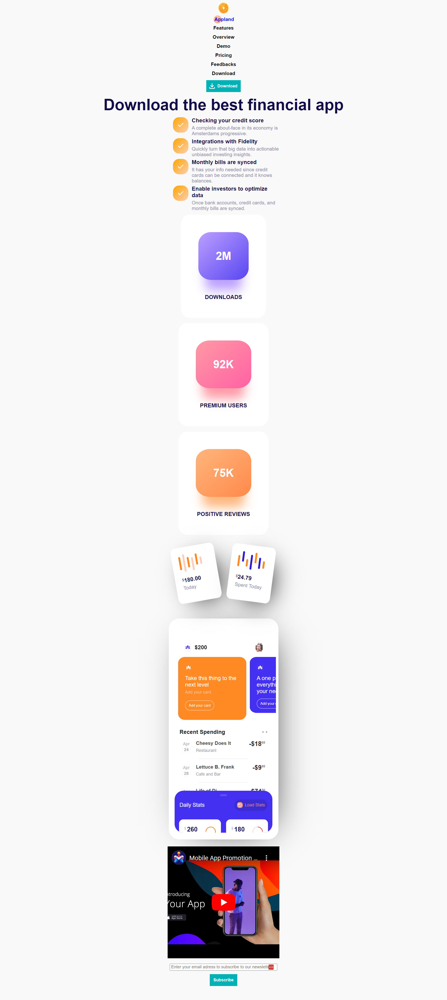

# Product Landing Page

This is the fourth project done to obtain the Free Code Camp Responsive Web Design certification.

There was a requirement for the certification project to have a navigation bar that would always stay at the top of the viewport. It is removed here because, since the navigation bar is vertical, it would be taking way too much space.

[**Code Pen link**](https://codepen.io/Arnaud-Duhamel/full/wvOvybq)

<details>
  <summary>HTML code</summary>
  
```html

<!DOCTYPE html>
<html lang="en">
<head>
    <meta charset="UTF-8" />
    <meta name="viewport" content="width=device-width, initial-scale=1.0" />
    <meta name="description" content="Ann app product landing page" />
    <title>Product landing page</title>
    <link rel="stylesheet" href="styles.css" />
</head>
    <body>
        <header id="header">
            <nav id="nav-bar">
                <ul>
                    <li id="header-img-container"></li>
                    <li><div class="logo_container"><div class="logo">Appland</div></div></li>
                    <li><a class="nav-link" href="#features">Features</a></li>
                    <li><a class="nav-link" href="#overview">Overview</a></li>
                    <li><a class="nav-link" href="#demo">Demo</a></li>
                    <li><a href="#">Pricing</a></li>
                    <li><a href="#">Feedbacks</a></li>
                    <li><a href="#">Download</a></li>
                    <li class="download_button_section"><button type="button" class="download_button"><svg xmlns="http://www.w3.org/2000/svg" height="24" viewBox="0 -960 960 960" width="24"><path d="M480-320 280-520l56-58 104 104v-326h80v326l104-104 56 58-200 200ZM240-160q-33 0-56.5-23.5T160-240v-120h80v120h480v-120h80v120q0 33-23.5 56.5T720-160H240Z"/></svg><p>Download</p></button></li>
                </ul>
            </nav>
        </header>
        <main>
            <h1>Download the best financial app</h1>
            <section id="features" class="description_section">
                <div class="description"><svg class="done_icon" xmlns="http://www.w3.org/2000/svg" height="24" viewBox="0 -960 960 960" width="24"><path d="M382-240 154-468l57-57 171 171 367-367 57 57-424 424Z"/></svg><div>
                    <p class="description_title">Checking your credit score</p>
                    <p class="description_content">A complete about-face in its economy is Amsterdams progressive.</p>
                </div></div>
                <div class="description"><svg class="done_icon" xmlns="http://www.w3.org/2000/svg" height="24" viewBox="0 -960 960 960" width="24"><path d="M382-240 154-468l57-57 171 171 367-367 57 57-424 424Z"/></svg><div>
                    <p class="description_title">Integrations with Fidelity</p>
                    <p class="description_content">Quickly turn that big data into actionable unbiased investing insights.</p>
                </div></div>
                <div class="description"><svg class="done_icon" xmlns="http://www.w3.org/2000/svg" height="24" viewBox="0 -960 960 960" width="24"><path d="M382-240 154-468l57-57 171 171 367-367 57 57-424 424Z"/></svg><div>
                    <p class="description_title">Monthly bills are synced</p>
                    <p class="description_content">It has your info needed since credit cards can be connected and it knows balances.</p>
                </div></div>
                <div class="description"><svg class="done_icon" xmlns="http://www.w3.org/2000/svg" height="24" viewBox="0 -960 960 960" width="24"><path d="M382-240 154-468l57-57 171 171 367-367 57 57-424 424Z"/></svg><div>
                    <p class="description_title">Enable investors to optimize data</p>
                    <p class="description_content">Once bank accounts, credit cards, and monthly bills are synced.</p>
                </div></div>
            </section>
            <section id="overview" class="boxes_section">
                <div class="box">
                    <p class="box_data one">2M</p>
                    <p class="box_text">DOWNLOADS</p>
                </div>
                <div class="box">
                    <p class="box_data two">92K</p>
                    <p class="box_text">PREMIUM USERS</p>
                </div>
                <div class="box">
                    <p class="box_data three">75K</p>
                    <p class="box_text">POSITIVE REVIEWS</p>
                </div>
            </section>
            <section class="small_boxes">
                <div class="small_box one">
                    <div class="line_row">
                        <div class="line_container one">
                            <div class="line one"></div>
                        </div>
                        <div class="line_container two">
                            <div class="line two"></div>
                        </div>
                        <div class="line_container three">
                            <div class="line three"></div>
                        </div>
                        <div class="line_container four">
                            <div class="line four"></div>
                        </div>
                        <div class="line_container five">
                            <div class="line five"></div>
                        </div>
                        <div class="line_container six">
                            <div class="line six"></div>
                        </div>
                    </div>
                    <div class="number">
                        <p class="dollar_sign">$</p>
                        <p class="amount">180.00</p>
                    </div>
                    <p class="small_box_description">Today</p>
                </div>
                <div class="small_box two">
                    <div class="line_row">
                        <div class="line_container seven">
                            <div class="line seven"></div>
                        </div>
                        <div class="line_container eight">
                            <div class="line eight"></div>
                        </div>
                        <div class="line_container nine">
                            <div class="line nine"></div>
                        </div>
                        <div class="line_container ten">
                            <div class="line ten"></div>
                        </div>
                        <div class="line_container eleven">
                            <div class="line eleven"></div>
                        </div>
                        <div class="line_container twelve">
                            <div class="line twelve"></div>
                        </div>
                        <div class="line_container thirteen">
                            <div class="line thirteen"></div>
                        </div>
                    </div>
                    <div class="number">
                        <p class="dollar_sign">$</p>
                        <p class="amount">24.79</p>
                    </div>
                    <p class="small_box_description">Spent Today</p>
                </div>
            </section>
            <section id="demo" class="smartphone_section">
                <div class="smartphone">
                    <div class="app_bar">
                        <div class="app_bar_left">
                            <div class="lotus_container purple">
                                <?xml version="1.0" encoding="iso-8859-1"?>
                                    <!-- Uploaded to: SVG Repo, www.svgrepo.com, Generator: SVG Repo Mixer Tools -->
                                    <svg class="lotus purple" fill="#000000" height="14px" width="14px" version="1.1" id="Layer_1" xmlns="http://www.w3.org/2000/svg" xmlns:xlink="http://www.w3.org/1999/xlink" 
                                        viewBox="0 0 512 512" xml:space="preserve">
                                        <g>
                                            <g>
                                                <g>
                                                    <path d="M205.867,364.795c-5.754,0.608-15.501,1.389-27.658,1.389c-31.076,0-77.727-5.134-112.693-31.359
                                                        C34.93,350.329,10.713,375.897,0,388.396c15.983,18.648,62.023,66.389,114.434,66.388c52.577,0,98.505-47.727,114.441-66.377
                                                        C223.894,382.593,215.985,373.945,205.867,364.795z"/>
                                                    <path d="M446.245,334.708c-34.981,26.324-81.723,31.476-112.845,31.476c-11.916,0-21.519-0.75-27.316-1.353
                                                        c-10.091,9.129-17.982,17.757-22.959,23.564c15.982,18.648,62.018,66.389,114.43,66.388
                                                        c52.578,0.001,98.508-47.726,114.445-66.375C501.269,375.884,476.952,350.206,446.245,334.708z"/>
                                                    <path d="M198.416,340.733c0.055-0.718,0.109-1.48,0.164-2.27c-27.465-32.128-55.905-77.85-55.905-129.438
                                                        c0-4.031,0.189-8.023,0.523-11.979C105.908,176.27,56.889,177.339,36.586,178.9c-1.886,24.489-3.088,90.803,33.973,127.861
                                                        C107.615,343.819,173.925,342.617,198.416,340.733z"/>
                                                    <path d="M313.088,339.308c0.034,0.48,0.068,0.974,0.102,1.426c24.474,1.885,90.793,3.092,127.855-33.972
                                                        c37.179-37.176,35.908-103.403,33.99-127.859c-20.149-1.554-68.666-2.629-105.873,17.723c0.357,4.093,0.556,8.224,0.556,12.398
                                                        C369.718,261.067,340.775,307.139,313.088,339.308z"/>
                                                    <path d="M256.194,57.217c-22.488,18.886-88.917,80.701-88.917,151.809c0,71.11,66.429,132.927,88.917,151.811
                                                        c22.479-18.876,88.922-80.696,88.922-151.811C345.116,137.918,278.683,76.101,256.194,57.217z"/>
                                                </g>
                                            </g>
                                        </g>
                                    </svg>
                                </div>
                            <p class="app_bar_text">$200</p>
                        </div>
                        
                    </div>
                <div class="rolling_menu">
                    <div class="rolling_box one">
                        <div class="lotus_container orange">
                            <?xml version="1.0" encoding="iso-8859-1"?>
                                <!-- Uploaded to: SVG Repo, www.svgrepo.com, Generator: SVG Repo Mixer Tools -->
                                <svg class="lotus white" fill="#000000" height="14px" width="14px" version="1.1" id="Layer_1" xmlns="http://www.w3.org/2000/svg" xmlns:xlink="http://www.w3.org/1999/xlink" 
                                    viewBox="0 0 512 512" xml:space="preserve">
                                    <g>
                                        <g>
                                            <g>
                                                <path d="M205.867,364.795c-5.754,0.608-15.501,1.389-27.658,1.389c-31.076,0-77.727-5.134-112.693-31.359
                                                    C34.93,350.329,10.713,375.897,0,388.396c15.983,18.648,62.023,66.389,114.434,66.388c52.577,0,98.505-47.727,114.441-66.377
                                                    C223.894,382.593,215.985,373.945,205.867,364.795z"/>
                                                <path d="M446.245,334.708c-34.981,26.324-81.723,31.476-112.845,31.476c-11.916,0-21.519-0.75-27.316-1.353
                                                    c-10.091,9.129-17.982,17.757-22.959,23.564c15.982,18.648,62.018,66.389,114.43,66.388
                                                    c52.578,0.001,98.508-47.726,114.445-66.375C501.269,375.884,476.952,350.206,446.245,334.708z"/>
                                                <path d="M198.416,340.733c0.055-0.718,0.109-1.48,0.164-2.27c-27.465-32.128-55.905-77.85-55.905-129.438
                                                    c0-4.031,0.189-8.023,0.523-11.979C105.908,176.27,56.889,177.339,36.586,178.9c-1.886,24.489-3.088,90.803,33.973,127.861
                                                    C107.615,343.819,173.925,342.617,198.416,340.733z"/>
                                                <path d="M313.088,339.308c0.034,0.48,0.068,0.974,0.102,1.426c24.474,1.885,90.793,3.092,127.855-33.972
                                                    c37.179-37.176,35.908-103.403,33.99-127.859c-20.149-1.554-68.666-2.629-105.873,17.723c0.357,4.093,0.556,8.224,0.556,12.398
                                                    C369.718,261.067,340.775,307.139,313.088,339.308z"/>
                                                <path d="M256.194,57.217c-22.488,18.886-88.917,80.701-88.917,151.809c0,71.11,66.429,132.927,88.917,151.811
                                                    c22.479-18.876,88.922-80.696,88.922-151.811C345.116,137.918,278.683,76.101,256.194,57.217z"/>
                                            </g>
                                        </g>
                                    </g>
                                </svg>
                            </div>
                            <p class="rolling_box_text">Take this thing to the next level </p>
                            <p class="rolling_box_undertext">Add your card</p>
                            <button type="button" class="buy_button orange">Add your card</button>
                    </div>
                    <div class="rolling_box two">
                        <div class="lotus_container blue">
                            <?xml version="1.0" encoding="iso-8859-1"?>
                                <!-- Uploaded to: SVG Repo, www.svgrepo.com, Generator: SVG Repo Mixer Tools -->
                                <svg class="lotus white" fill="#000000" height="14px" width="14px" version="1.1" id="Layer_1" xmlns="http://www.w3.org/2000/svg" xmlns:xlink="http://www.w3.org/1999/xlink" 
                                    viewBox="0 0 512 512" xml:space="preserve">
                                    <g>
                                        <g>
                                            <g>
                                                <path d="M205.867,364.795c-5.754,0.608-15.501,1.389-27.658,1.389c-31.076,0-77.727-5.134-112.693-31.359
                                                    C34.93,350.329,10.713,375.897,0,388.396c15.983,18.648,62.023,66.389,114.434,66.388c52.577,0,98.505-47.727,114.441-66.377
                                                    C223.894,382.593,215.985,373.945,205.867,364.795z"/>
                                                <path d="M446.245,334.708c-34.981,26.324-81.723,31.476-112.845,31.476c-11.916,0-21.519-0.75-27.316-1.353
                                                    c-10.091,9.129-17.982,17.757-22.959,23.564c15.982,18.648,62.018,66.389,114.43,66.388
                                                    c52.578,0.001,98.508-47.726,114.445-66.375C501.269,375.884,476.952,350.206,446.245,334.708z"/>
                                                <path d="M198.416,340.733c0.055-0.718,0.109-1.48,0.164-2.27c-27.465-32.128-55.905-77.85-55.905-129.438
                                                    c0-4.031,0.189-8.023,0.523-11.979C105.908,176.27,56.889,177.339,36.586,178.9c-1.886,24.489-3.088,90.803,33.973,127.861
                                                    C107.615,343.819,173.925,342.617,198.416,340.733z"/>
                                                <path d="M313.088,339.308c0.034,0.48,0.068,0.974,0.102,1.426c24.474,1.885,90.793,3.092,127.855-33.972
                                                    c37.179-37.176,35.908-103.403,33.99-127.859c-20.149-1.554-68.666-2.629-105.873,17.723c0.357,4.093,0.556,8.224,0.556,12.398
                                                    C369.718,261.067,340.775,307.139,313.088,339.308z"/>
                                                <path d="M256.194,57.217c-22.488,18.886-88.917,80.701-88.917,151.809c0,71.11,66.429,132.927,88.917,151.811
                                                    c22.479-18.876,88.922-80.696,88.922-151.811C345.116,137.918,278.683,76.101,256.194,57.217z"/>
                                            </g>
                                        </g>
                                    </g>
                                </svg>
                            </div>
                            <p class="rolling_box_text">A one place to shop everything that fits your need</p>
                            <button type="button" class="buy_button blue">Add your card</button>
                    </div>
                </div>
                <div class="recent_spendings_header">
                    <p class="recent_spendings_text">Recent Spending</p>
                        <p class="two_dots">• •</p>
                </div>
                    <div class="spending_list">
                        <div class="spending_item">
                            <div class="date_and_description">
                                <div class="date">
                                    <p class="month">Apr</p>
                                    <p class="day">24</p>
                                </div>
                                <div class="spending_item_description">
                                    <p class="spending_item_description_text">Cheesy Does It</p>
                                    <p class="spending_item_description_undertext">Restaurant</p>
                                </div>
                            </div>
                            <div class="speding_item_price">
                                <p class="speding_item_price_units">-$18</p>
                                <p class="speding_item_price_decimals">65</p>
                            </div>
                        </div>
                        <div class="separator"></div>
                        <div class="spending_item">
                            <div class="date_and_description">
                                <div class="date">
                                    <p class="month">Apr</p>
                                    <p class="day">28</p>
                                </div>
                                <div class="spending_item_description">
                                    <p class="spending_item_description_text">Lettuce B. Frank</p>
                                    <p class="spending_item_description_undertext">Cafe and Bar</p>
                                </div>
                            </div>
                            <div class="speding_item_price">
                                <p class="speding_item_price_units">-$9</p>
                                <p class="speding_item_price_decimals">95</p>
                            </div>
                        </div>
                        <div class="separator"></div>
                        <div class="spending_item">
                            <div class="date_and_description">
                                <div class="date">
                                    <p class="month">Apr</p>
                                    <p class="day">30</p>
                                </div>
                                <div class="spending_item_description">
                                    <p class="spending_item_description_text">Life of Di</p>
                                    <p class="spending_item_description_undertext">Clothing Store</p>
                                </div>
                            </div>
                            <div class="speding_item_price">
                                <p class="speding_item_price_units">-$74</p>
                                <p class="speding_item_price_decimals">50</p>
                            </div>
                        </div>
                    </div>
                    <div class="appearing_page">
                        <div class="center_button"></div>
                        <div class="appearing_page_header">
                            <p class="appearing_page_header_text">Daily Stats</p>                        
                                <button type="button" class="load_stats_button">
                                    <div class="refresh_icon_container">
                                        <svg class="refresh_icon" xmlns="http://www.w3.org/2000/svg" height="14" viewBox="0 -960 960 960" width="14"><path d="M480-160q-134 0-227-93t-93-227q0-134 93-227t227-93q69 0 132 28.5T720-690v-110h80v280H520v-80h168q-32-56-87.5-88T480-720q-100 0-170 70t-70 170q0 100 70 170t170 70q77 0 139-44t87-116h84q-28 106-114 173t-196 67Z"/></svg>
                                    </div>
                                    <p class="load_stats_button_text">Load Stats</p>
                                </button>
                            </div>
                            <div class="data_section">
                                <div class="data_square">
                                    <div class="data_content">
                                        <div class="data_content_number">
                                            <p class="data_content_dollar_sign">$</p>
                                            <p class="data_content_amount">260</p>
                                        </div>
                                        <div class="circle left"></div>
                                    </div>
                                </div>
                                <div class="data_square">
                                    <div class="data_content">
                                        <div class="data_content_number">
                                            <p class="data_content_dollar_sign">$</p>
                                            <p class="data_content_amount">180</p>
                                        </div>
                                        <div class="circle right"></div>
                                    </div>
                                </div>
                            </div>
                    </div>
                    </div>
                </div>
            </section>
            <iframe id="video" src="https://www.youtube.com/embed/yKCAna4SrOA"></iframe>
            <form id="form" action="https://www.freecodecamp.com/email-submit">
                <input id="email" name="email" placeholder="Enter your email adress to subscribe to our newsletter" type="email" required/>
                <input id="submit" type="submit" value="Subscribe" />
            </form>
            <footer></footer>
        </main>
    </body>
</html>

```

</details>

<details>
  <summary>CSS code</summary>
  
```css

html {
   box-sizing: border-box;
   font-size: 16ptx;
}

body {
    margin: 0;
    padding: 0;
    background-color: #F9F9F9;
    font-family: Arial, Helvetica, sans-serif;
}

header {
    margin-top: 10px;
    background-color: #F9F9F9;
}

p {
    margin: 0;
    padding: 0;
}

nav > ul {
    display: flex;
    flex-direction: column;
    align-items: center;
    justify-content:center;
    list-style-type: none;
    padding: 0;
    margin: 0;
    font-size: 14px;
}

li {
    display: flex;
    justify-content: center;
    align-items: center;
    height: 26px;
}

#header-img-container {
    padding-bottom: 5px;
}

#header-img {
    width: 35px;
    height: 35px;
}

a {
    display: flex; 
    align-items: center; 
    justify-content: center;
    text-decoration: none;
    color: black;
    font-weight: bold;
    height: 100%;
}

a:hover {
    text-decoration: underline;
    text-decoration-thickness: 2px;
}

.download_button{
    display: flex;
    align-items: center;
    justify-content: center;
    border: none;
    background-color: #00b2b6;
    font-size: 12px;
    font-weight: bold;
    color: white;
    padding: 5px 10px 5px 5px;
    cursor: pointer;
}

.download_button_section {
    margin-top: 10px;
    padding-bottom: 5px;
}

.download_button > p {
    margin: 0 0 0 0.5vh;
    padding: 0;
}

.download_button > svg {
    fill: white;
}

.logo {
    display: flex;
    align-items: center;
    justify-content: left;
    font-weight: bold;
    color: #0000ff;
    background: linear-gradient(to left top, #ffa267, #fcceb1);
    padding: 0 0 0 3px;
    height: 23px;
    width: 20px;
    border-radius: 50%;
}

.logo_container {
    margin-top: 1vh;
    width: 58px;
    height: 26px;
}

main {
    display: flex;
    flex-direction: column;
    align-items: center;
    justify-content: start;
}

h1 {
    color: #120c4b;
    text-align: center;
    margin: 10px 15px;
}

.description_section {
    display: flex;
    flex-direction: column;
    align-items: start;
    justify-content: start;
    width: 320px;
}

.description {
    display: flex;
    flex-direction: row;
    align-items: start;
    justify-content: start;
    gap: 10px;
    max-width: 90vw;
    margin-left: 15px;
    margin-bottom: 5px;
}

.done_icon {
    fill: white;
    background: linear-gradient(to right bottom, #ffa500, #fcceb1);
    padding: 10px;
    border-radius: 40%;
    min-width: 24px;
    min-height: 24px;
}

.description_title {
    color: #120c4b;
    font-weight: bold;
    font-size: 16px;
    margin: 0 0 4px 0;
}

.description_content {
    color: #8d8aa9;
    font-size: 14px;
}

.boxes_section {
    display: flex;
    flex-direction: column;
    align-items: center;
    justify-content: center;
    gap: 15px;
    margin-top: 5px;
    margin-bottom: 30px;
}

.box {
    text-align: center;
    background-color: white;
    padding: 50px;
    border-radius: 10%;
}

.box_data {
    display: inline-block;
    color: white;
    font-weight: bold;
    font-size: 32px;
    background-color: black;
    padding: 50px;
    border-radius: 25%;
    margin-bottom: 40px;
}

.box_data.one {
    background: linear-gradient(to right bottom, #bb9fff, #5946f1);
    box-shadow: 0 50px 30px -20px #bb9fff;
}

.box_data.two {
    background: linear-gradient(to right bottom, #ff99a5, #ff61a3);
    box-shadow: 0 50px 30px -20px #ff99a5;
}

.box_data.three {
    background: linear-gradient(to right bottom, #ffb57c, #ff894a);
    box-shadow: 0 50px 30px -20px #ffb57c;
}

.box_text {
    text-align: center;
    color: #120c4b;
    font-weight: bold;
    font-size: 16px;
}

.small_boxes {
    display: flex;
    flex-direction: row;
    align-items: center;
    justify-content: space-evenly;
    gap: 15px;
    margin-bottom: 35px;
    width: 320px;
}

.small_box {
    display: flex;
    flex-direction: column;
    align-items: start;
    justify-content: start;
    width: 85px;
    background-color: white;
    padding: 20px 20px 35px 20px;
    border-radius: 10%;
    box-shadow: 20px 20px 70px -25px black;
                
}

.small_box.one {
    transform: rotate(-10deg);
}

.small_box.two {
    transform: rotate(7.5deg);
}

.line_row {
    display: flex;
    flex-direction: row;
    align-items: center;
    justify-content: start;
    height: 50px;
    width: 100%;
    gap: 7px;
    margin-bottom: 15px;
}

.line_container {
    width: 5px;
}

.line_container.one {
    height: 75%;
}

.line_container.two {
    height: 100%;
}

.line_container.three {
    height: 60%;
}

.line_container.four {
    display: flex;
    flex-direction: column;
    align-items: center;
    justify-content: end;
    height: 100%;
}

.line_container.five {
    align-self: flex-start;
    display: flex;
    flex-direction: column;
    align-items: center;
    justify-content: center;
    height: 80%;
}

.line_container.six {
    align-self: flex-start;
    display: flex;
    flex-direction: column;
    align-items: center;
    justify-content: end;
    height: 72%;
}

.line_container.seven {
    align-self: flex-end;
    display: flex;
    flex-direction: column;
    align-items: center;
    justify-content: center;
    height: 85%;
}

.line_container.eight {
    display: flex;
    flex-direction: column;
    align-items: center;
    justify-content: start;
    height: 100%;
}

.line_container.nine {
    align-self: flex-start;
    display: flex;
    flex-direction: column;
    align-items: center;
    justify-content: end;
    height: 85%;
}

.line_container.ten {
    display: flex;
    flex-direction: column;
    align-items: center;
    justify-content: end;
    height: 100%;
}

.line_container.eleven {
    display: flex;
    flex-direction: column;
    align-items: center;
    justify-content: start;
    height: 100%;
}

.line_container.twelve {
    align-self: flex-end;
    display: flex;
    flex-direction: column;
    align-items: center;
    justify-content: center;
    height: 85%;
}

.line_container.thirteen {
    align-self: flex-start;
    display: flex;
    flex-direction: column;
    align-items: center;
    justify-content: end;
    height: 85%;
}

.line {
    border-radius: 50px;
}

.line.one {
    background-color: #ff8822;
    height: 100%;
    width: 100%;
}

.line.two {
    background-color: #ffcebb;
    height: 100%;
    width: 100%;
}

.line.three {
    background-color: #ff8822;
    height: 100%;
    width: 100%;
}

.line.four {
    background-color: #ffcebb;
    height: 75%;
    width: 100%;
}

.line.five {
    background-color: #ff8822;
    height: 80%;
    width: 100%;
}

.line.six {
    background-color: #ffcebb;
    height: 60%;
    width: 100%;
}

.line.seven {
    background-color: #ff8923;
    height: 75%;
    width: 100%;
}

.line.eight {
    background-color: #3219de;
    height: 60%;
    width: 100%;
}

.line.nine {
    background-color: #ff8923;
    height: 50%;
    width: 100%;
}

.line.ten {
    background-color: #3219de;
    height: 85%;
    width: 100%;
}

.line.eleven {
    background-color: #ff8923;
    height: 60%;
    width: 100%;
}

.line.twelve {
    background-color: #3219de;
    height: 75%;
    width: 100%;
}

.line.thirteen {
    background-color: #ff8923;
    height: 50%;
    width: 100%;
}

.number {
    display: flex;
    flex-direction: row;
    align-items: start;
    justify-content: start;
    margin-bottom: 5px;
}

.dollar_sign {
    color: #120c4b;
    font-size: 10px;
    margin: 1.5px 0 0 0;
}

.amount {
    color: #120c4b;
    font-weight: bold;
    font-size: 16px;
}

.small_box_description {
    color: #8d8aa9;
    font-size: 14px;
}

.smartphone_section {
    display: flex;
    flex-direction: column;
    align-items: center;
    justify-content: start;
    margin-top: 15px;
}

.smartphone {
    display: flex;
    flex-direction: column;
    align-items: center;
    justify-content: start;
    height: 545px;
    width: 280px;
    background-color: white;
    border-radius: 30px;
    padding: 70px 17px 17px 17px;
    box-shadow: 20px 10px 110px -50px black;
}

.app_bar {
    display: flex;
    flex-direction: row;
    align-items: center;
    justify-content: space-between;
    width: 80%;
    margin-bottom: 15px;
}

.app_bar_left {
    display: flex;
    flex-direction: row;
    align-items: center;
    justify-content:start;
    gap: 10px;
}


.lotus_container {
    border-width: 1px;
    border-style: solid;
    border-radius: 40%;
}

.lotus_container.purple {
    border-color: #e9e7fd;
}

.lotus {
    padding: 2px 2px 0 2px;
}

.lotus.purple {
    fill: #5642f1;
}

.app_bar_text {
    font-size: 16px;
    color: #20232a;
    font-weight: bold;
}

img {
    width: 20px;
    height: 25px;
    border-radius: 35%;
}

.rolling_menu {
    display: flex;
    flex-direction: row;
    align-items: start;
    justify-content: start;
    width: 100%;
    overflow-x: hidden;
    gap: 10px;
    margin-left: 20px;
}

.rolling_box {
    display: flex;
    flex-direction: column;
    align-items: start;
    justify-content: start;
}

.rolling_box.one {
    height: 140px;
    min-width: 155px;
    padding: 20px;
    background-color: #ff8923;
    border-radius: 10%;
}

.lotus_container.orange {
    border-color: #f19146;
    margin-bottom: 10px;
}

.lotus.white {
    fill: white;
}

.rolling_box_text {
    font-size: 16px;
    font-weight: 500;
    color: white;
    margin-bottom: 5px;
}

.rolling_box_undertext {
    font-size: 12px;
    color: #EAC4AF;
    margin-bottom: 17px;
}

.buy_button {
    color: white;
    font-size: 10px;
    border: 1px solid white;
    border-radius: 50px;
    padding: 7.5px 10px 7.5px 10px;
}

.buy_button.orange {
    background-color: #ff8923;
}

.rolling_box.two {
    height: 120px;
    min-width: 155px;
    padding: 20px;
    background-color: #4330f2;
    border-radius: 10%;
}

.lotus_container.blue {
    border-color: #5742f3;
    margin-bottom: 10px;
}

.buy_button.blue {
    margin-top: 7px;
    background-color: #4330f2;
}

.recent_spendings_header {
    margin-top: 25px;
    display: flex;
    flex-direction: row;
    justify-content: space-between;
    width: 90%;
}

.recent_spendings_text {
    font-size: 16px;
    color: #191A21;
    font-weight: bold;
}

.two_dots {
    color: #9fa1af;
}

.spending_list {
    display: flex;
    flex-direction: column;
    justify-content: center;
    align-items: center;
    width: 85%;
}

.spending_item {
    display: flex;
    flex-direction: row;
    align-items: center;
    justify-content: space-between;
    width: 100%;
    padding: 15px 0;
}

.date_and_description {
    display: flex;
    flex-direction: row;
    align-items: start;
    justify-content: center;
    height: 36px;
    gap: 15px;
}

.date {
    display: flex;
    flex-direction: column;
    align-items: center;
    justify-content: center;
    border: 1px solid #F6F6F7;
    border-radius: 25%;
}

.month {
    color: #ABADB4;
    font-size: 12px;
    padding: 2.5px 2.5px 1.25px 2.5px;
}

.day {
    font-size: 12px;
    font-weight: bold;
    color: #ABADB4;
    padding: 1.25px 2.5px 2.5px 2.5px;
}

.spending_item_description {
    display: flex;
    flex-direction: column;
    align-items: start;
    justify-content: space-between;
    height: 100%;
}

.spending_item_description_text {
    font-size: 14px;
    font-weight: bold;
    color: #45464C;
}

.spending_item_description_undertext {
    font-size: 12px;
    color: #9797A2;
}

.speding_item_price {
    display: flex;
    flex-direction: row;
    align-items: start;
    justify-content: center;
    height: 36px;
}

.speding_item_price_units {
    font-size: 18px;
    color: #212329;
    font-weight: bold;
}

.speding_item_price_decimals {
    font-size: 9px;
    color: #81838F;
    font-weight: bold;
    margin-top: 1.5px;
}

.separator {
    height: 2px;
    width: 60%;
    background-color: #F5F5F5;
}

.appearing_page {
    display: flex;
    flex-direction: column;
    align-items: center;
    justify-content: start;
    width: 100%;
    height: 120px;
    background-color: #4330F1;
    overflow-y: hidden;
    border-radius: 25px;
    margin-top: -43px;
    padding: 0;
    margin-bottom: 0;
    border: none;
    /*z-index: -0;*/
}

.center_button {
    width: 20px;
    min-height: 5px;
    max-height: 5px;
    margin: 10px 0;
    background-color: #624EF3;
    border-radius: 5px;
}

.appearing_page_header {
    display: flex;
    flex-direction: row;
    align-items: center;
    justify-content: space-between;
    width: 90%;
}

.appearing_page_header_text {
    font-size: 15px;
    color: #feffff;
}

.load_stats_button {
    display: flex;
    flex-direction: row;
    align-items: center;
    justify-content: space-between;
    height: 100%;
    background-color: #3a2cd0;
    border: none;
    width: 95px;
    padding: 7.5px;
    border-radius: 20px;
}

.refresh_icon_container {
    display: flex;
    align-items: center;
    justify-content: center;
    background-color: #EB918B;
    border-radius: 40%;
    padding: 1.5px;
}

.refresh_icon {
    fill: white;
    transform: scaleX(-1);
}

.load_stats_button_text {
    color: #DA878D;
    font-size: 12px;
}

.data_section {
    margin-top: 25px;
    display: flex;
    flex-direction: row;
    justify-content: center;
    gap: 15px;
    width: 100%;
    /*z-index: 1;*/
}

.data_square {
    display: flex;
    flex-direction: column;
    justify-content: start;
    align-items: center;
    background-color: white;
    height: 120px;
    width: 120px;
    border-radius: 10%;
}

.data_content {
    display: flex;
    flex-direction: row;
    justify-content: space-between;
    align-items: start;
    width: 75%;
    margin-top: 20px;
}

.data_content_number {
    display: flex;
    flex-direction: row;
    justify-content: start;
    align-items: start;
    gap: 2.5px;
}

.data_content_dollar_sign {
    color: #B1B3B9;
    font-size: 10px;
}

.data_content_amount {
    color: #100A5A;
    font-weight: bold;
    font-size: 18px;
    margin-top: -1.5px;
}

.circle {
    background-color: white;
    height: 25px;
    width: 25px;
    border-radius: 50%;
    margin-top: 0.5px;
    transform: rotate(45deg);    
}

.circle.left {
    border-left: 2px solid #FF8821;
    border-top: 2px solid #FF8821;
    border-right: 2px solid #FF8821;
    border-bottom: 2px solid #FFEFE0;
}

.circle.right {
    border: 2px solid #F8DBDD;
    border-top: 2px solid #EC5150;
}

#video {
    margin-top: 20px;
    border: none;
    width: 320px;
    height: 320px;
}

footer {
    height: 30px;
}

#form {
    margin-top: 15px;
    display: flex;
    flex-direction: column;
    justify-content: center;
    align-items: center;
    gap: 10px;
    width: 320px;
}

#email {
    width: 300px;
    font-size: 12px;
}

#submit {
    display: flex;
    justify-content: center;
    align-items: center;
    border: none;
    background-color: #00b2b6;
    font-size: 12px;
    font-weight: bold;
    color: white;
    padding: 10px;
    cursor: pointer;
}

@media only screen and (min-width: 720px) {
    h1 {
      font-size: 45px;
    }
  }

```

</details>

I tried to replicate this page, but for mobile: 


## final product


